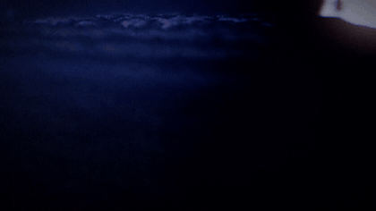
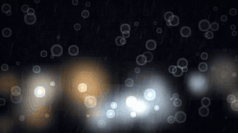

# 🌍 Dollars — القناة العالمية (دوشة)

مصنع سحابي كامل (GitHub Actions · بلا سيرفر · بلا ميزانية) لقناة عالمية في
مجال **الهدوء والنوم والتركيز** — مشاهد كونية وطبيعية سينمائية + همس هادئ +
قصص أصلية، بلغات متعددة، وبصفر خطر حقوق ملكية.

- 📋 **الخطة الكاملة:** [`PLAN.md`](PLAN.md) — اقرأها الأول، فيها الأرقام الحقيقية والخطوط الحمراء.
- 🎯 **الهدف الحقيقي (مش الوهمي):** 1,000 مشترك + 4,000 ساعة مشاهدة **قبل 1 فبراير 2027**
  (لأن شروط المونيتايزيشن بتغلى بعدها) → وبعدها السلم لحد 500 ألف مشترك.
- 🚫 **ممنوع تمامًا:** أصوات مشاهير/أشخاص حقيقيين · نسخ فيديوهات مشهورة · موسيقى محمية ·
  قوالب متكرّرة بلا قيمة · شراء مشاهدات أو متابعين.
- ✅ **مضمون في التصميم:** إفصاح عن الوسائط المولّدة · سجل ترخيص لكل ميديا ·
  بوابات منع قبل كل رفع · خزّان حلقات + حارس استمرار (المصنع ما يوقفش).

## الهيكل (قيد الإنشاء)
```
engine/   توليد المشاهد (كون/طبيعة/مطر) + المونتاج + الصوت
voice/    الأصوات النيورالية المملوكة + الهمس + إيقاع الهدوء
content/  بنك الأفكار + السكربتات الأصلية
i18n/     ترجمة + عناوين أجنبية + مسارات دبلجة
state/    الذاكرة (كل فيديو · كل مصدر ميديا · كل نشر · الأرقام)
```

> ⚠️ لا يُنشر أي فيديو قبل ما يعدّي بوابات: الترخيص · الإفصاح · التنويع · القيمة.

---

## 🎬 الاستوديو بقى شغال — حركة حقيقية، مش صور
كل مشهد بيتولّد **كود + فيزيا** (جزيئات · موج · لهب · كور بتتحرك) — مفيش صورة ثابتة بتتحرك.

| وادي وبحيرة (3D) | غابة ثلجية (3D) | كوكب بحلقات (3D) |
|---|---|---|
|  |  |  |

| مطر على الزجاج | طاولة الرمل | موجة النواسير |
|---|---|---|
|  |  |  |

**8 مشاهد** + 4 ملصقات متحركة: سماء نجوم (شهب) · مطر على الزجاج (قطرات بتزحلق + برق) ·
بحر (موج ورغوة وقمر) · شفق قطبي · مدفأة (لهب وجمر) · طاولة رمل · موجة نواسير · هارمونوغراف.

- كل مشهد **حلقة رياضية مثالية** (المشهد عند `t + L` = المشهد عند `t` — فرق 0.000).
- فيديو 10 ساعات = نعمل الحلقة مرة واحدة ثم تتكرّر بـ `copy` ⇒ سريع وبلا استهلاك رام.
- **مكتبة ملكنا:** `assets/sfx` 32 مؤثر · `assets/stickers` 36 ملصق · `assets/memes` 6 قوالب — كلها مرسومة/متركّبة بالكود.


## 🏔️ محرّك ثلاثي الأبعاد حقيقي (مش صور مسطحة)
`engine/render3d.py` — محرّك 3D كامل بـnumpy (بلا GPU · بلا مكتبات · بلا حقوق):

| المشهد | إيه فيه | النوع |
|---|---|---|
| `valley_lake` | وادي بجبال ثلجية + بحيرة بانعكاس القمر + ضباب جوي + أشجار صنوبر | نوم 3/8/10 ساعات |
| `dunes_moon` | كثبان رملية تحت قمر ضخم + لمعة رمل + ظلال طويلة | نوم / هدوء |
| `snow_pines` | غابة صنوبر ثلجية وقت الفجر + ثلج بيتساقط + شبورة | نوم / عيد |
| `planet_rings` | كوكب بحلقات في الفضاء + ظل الحلقات + غلاف جوي | قصة / سحر |

**التقنيات جوه:** منظور Voxel-Space (تضاريس لا نهائية) · إضاءة مسبقة + تشطيب سطحي لكل بكسل ·
ضباب جوي بيلوّن البعيد بلون الجو الحقيقي · ماء بانعكاس فينل ولمعة قمر · **خريطة عمق لكل كادر**.

## 🎞️ طقم الجودة السينمائية
`engine/grade.py` — الفرق بين «شكل هواة» و«شكل إنتاج»:
تصحيح ألوان (Teal & Orange · Nocturne · Golden · Dream) · **Tonemap فيلمي** (بيملّ الأنوار
المحروقة) · **Bloom** و**هالة حمراء** حوالين الأضواء · **عمق ميدان حقيقي** من خريطة العمق ·
أشعة إلهية · فرق لوني سطري · حبيبات فيلم · فينييت · منحنى S لاسترجاع الطعمة.
وكل مظهر مقيَّم بـ`grade.quality_report` (تباين · تشبّع · حِدّة) عشان نعدّل بالأرقام مش بالإحساس.

## 🔍 الفحص الذاتي
`python tools/selfcheck.py` — بيراجع كل حاجة: المحركات · الحلقة المثالية (بأرقام) · المكتبة ·
الشخصيات · العقل · أرقام القناة · الملفات · الاختبارات، ويقول بصراحة إيه اللي خلص وإيه اللي ناقص.


## 📖 مُركّب الحِكايات بلا كلام (شخصياتنا في قصص حقيقية)
`engine/cutout.py` + `engine/story.py`: قصة = بيانات (بيتات)، والمُركّب يطلع فيلم كامل.

| نونو والمطر | كوكو والنجمة |
|---|---|
|  |  |

- **9 حركات للشخصيات:** تنفّس · نطّ بانضغاط وتمدّد · ميل · دوران · ظهور · مشي للداخل · سقوط · ترنّح،
  و**رمشة** تلقائية و**ظل تلامس** بيتّسع مع النطّ، والشخصية بتاخد لون جوّ المشهد.
- **بلا كلام تمامًا** (فحص إلزامي بيمنع أي نص على الشاشة) ⇒ أي حد في أي بلد يفهم.
- القصة بتتولّد بصوت كامل: أجواء + مؤثرات في توقيتاتها بالظبط (44.1kHz ستيريو).
- وبيطلع معاها **بيانات يوتيوب جاهزة** (عنوان · وصف · وسوم · إفصاح).

## 🖼️ أوراق الشخصيات (ثبات المظهر)
`engine/assets_ai.py` — بيبني **ورقة شخصية** (أمامي · جانبي · تعبيرات) من الطبقات المجانية:
Cloudflare Workers AI (FLUX · 10k neurons/يوم ≈ 170–230 صورة) → Pollinations (بلا مفتاح).
كل برومبت مقيّد بقواعدنا: **تصميم أصلي · بلا نص · ممنوع أي شبه بشخص حقيقي أو علامة محمية**.

## 🔎 بحث جيت هوب
`docs/RESEARCH_GITHUB_2026-09.md` — بحث فعلي بالـAPI: خدنا **المفاهيم** المفيدة (Voxel-Space مثلاً)
وكتبنا كودنا من الأول، ورفضنا أي حاجة GPL أو غير رسمية تحافظ على نضافة المشروع.

## 🧠 العقل الذاتي (بيشتغل كل يوم لوحده)
`engine/agent.py` بيتعلّم من أرقام القناة (مشاهدات · استمرار · تفاعل):
- بيحدّث وزن كل خصلة (نوع المحتوى · المشهد · المدة · الغلاف · الساعة) بمقارنتها بمتوسط أدائنا.
- بيضبط **معدّل تعلّمه واستكشافه بنفسه** حسب دقّة توقّعاته.
- بيولّد أفكار جديدة (شخصية × عالم × بنية × خطّاف) ويرتّبها بالتوقّع.
- بيخترع **شخصيات جديدة** (اسم · شكل · عالم · برومبت صورة) بموانع ضد أي تشابه مع أشخاص أو علامات.
- بيبني **خطة اليوم**: 24 شورت (واحد كل ساعة) + طويلات (4/6/8/12 ساعة).

## 📝 يوتيوب من أ ل ي
`engine/meta.py`: 3 عناوين للاختبار (A/B) · وصف SEO · فصول كل ساعة · وسوم ≤500 حرف ·
هاشتاجات ≤15 · تعليق مثبّت · 3 نصوص أغلفة · عناوين بـ**10 لغات** · إفصاح AI إلزامي ·
و**فحص شامل قبل النشر** (`meta.validate`).

## ⚙️ سير العمل على جيت هوب
| السير | إمتى | بيعمل إيه |
|---|---|---|
| 🧪 اختبارات الاستوديو | كل تحديث | 71 اختبار (مشاهد · حلقة · صوت · عقل · وصف) |
| 🧠 العقل الذاتي | كل يوم 04:30 | تعلّم + أفكار + شخصيات + خطة، ويحفظها في git |
| 🎬 مصنع الرندر | يدوي | يرندر مشهد + صوت + فيديو طويل ويرفعه كأرشيف |
